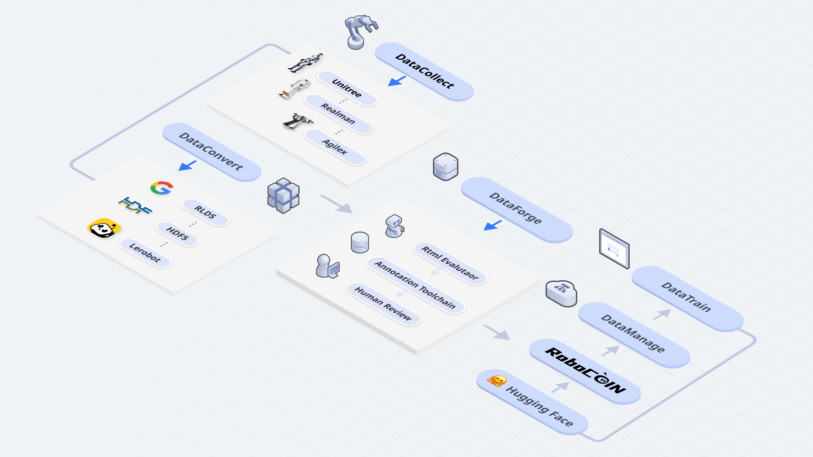
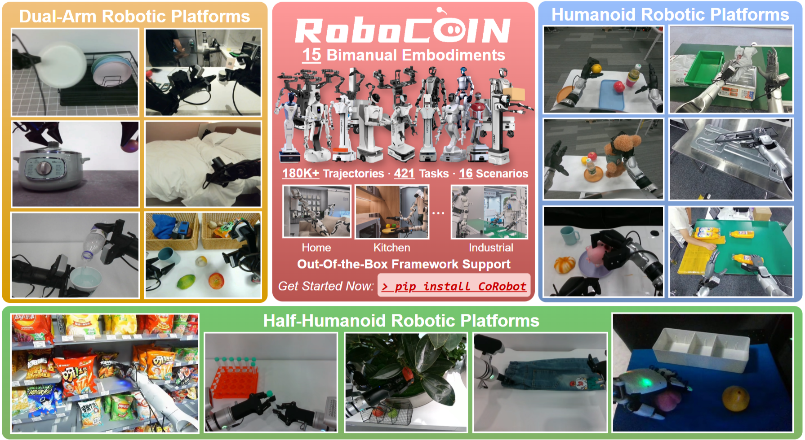
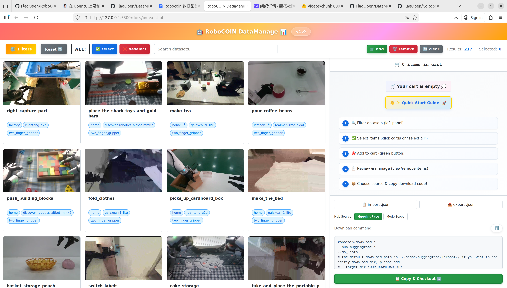
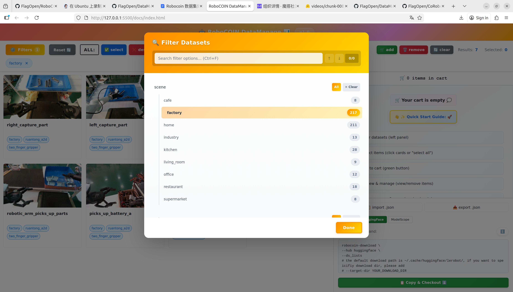
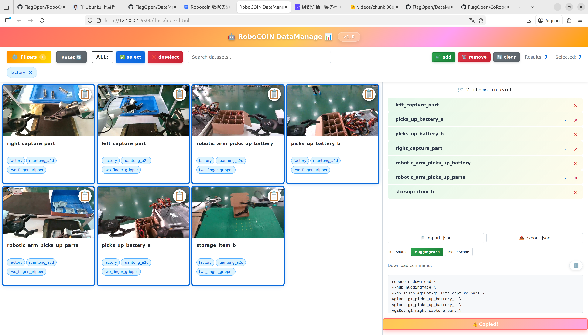
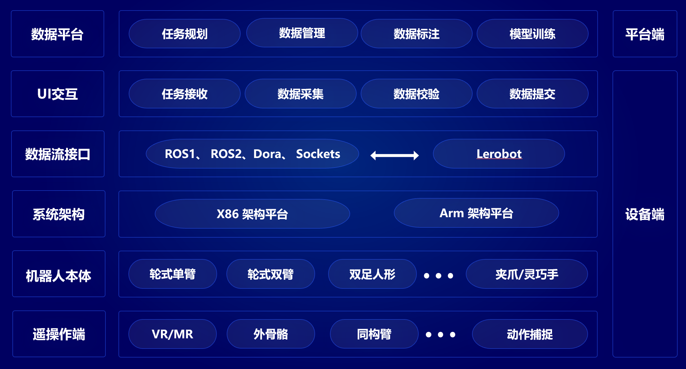

# CoRobot 1.0

[](https://github.com/FlagOpen/CoRobot/stargazers)
[](https://github.com/FlagOpen/CoRobot/issues)
[](https://github.com/FlagOpen/CoRobot/commits)
[](https://github.com/FlagOpen/CoRobot/pulls)
[](#corobot-10)

[English](README_en.md) | [中文](README.md)

具身数据开源框架 CoRobot 1.0——面向具身数据采集、转化、处理、检索、预览、下载和训练的全流程开源框架。其设计遵循“协同 (Collaboration)、一致 (Coherence)、聚合 (Collective)”三大核心理念，旨在通过一体化的数据基础设施提升多本体机器人数据的标准化程度与复用效率。
  


## 仓库模块
| 模块 | 角色 | 能力亮点 |
| --- | --- | --- |
| `RoboCoin` (`robocoin-lerobot`) | 数据与模型资产管理 | 多本体双臂操作数据集，16 款本体、20 万+ 轨迹、10+ 场景、1000+ 任务、50+ 技能、500+ 物体。 |
| `DataManage` | 数据治理 | 数据可视化检索：关键词检索、可视化展示，便于查询与针对性下载。 |
| `DataTrain` | 模型训练 | 统一训练工具：支持 OpenPI、RDT、DP 等具身模型的快速接入与训练。 |
| `DataCollect` | 数据采集 | 多本体数采工具：支持多种本体与遥操作，已接入睿尔曼、松灵、银河通用、宇树、乐聚、星海图、灵御、智元等。 |
| `DataConvert` | 数据转化 | 数据格式转化工具：支持 RLDS、HDF5、JSONL 与 LeRobotDataset 的双向转换。 |
| `DataForge` | 数据处理 | 数据处理工具：缺陷过滤（静止帧、跳帧、维度错位、字段缺失、轨迹抖动）与补充标注（场景、子任务、运动描述）。 |

## RoboCoin

- 数据集概览：
  
  
  
  
- `RoboCOIN` 是一个面向双臂操作研究的、大规模多本体的高质量数据集，涵盖 `15` 种不同的机器人平台，在 `421` 个任务与 `16` 个场景下提供 `180K` 条示范轨迹。

- 资源地址：
  - Hugging Face：https://huggingface.co/RoboCOIN
  - ModelScope：https://modelscope.cn/organization/RoboCOIN
  - 数据集持续更新，具体许可与版本以各数据集页面为准。

## DataManage

RoboCOIN 数据集可视化与管理平台，提供数据集在线检索、预览、筛选、下载的一站式解决方案。

- **在线访问**：[https://flagopen.github.io/DataManage/](https://flagopen.github.io/DataManage/)

- **核心功能**：
  - **多维度筛选**：支持按场景、机器人、末端执行器、动作、操作对象等维度过滤数据集
  - **实时预览**：数据集的视频自动播放与详情查看，支持悬浮信息层
  - **智能搜索**：关键词搜索与 Filter Finder 快速定位目标数据集
  - **购物车管理**：批量选择、添加、删除数据集，支持选择状态保持
  - **一键下载**：生成 ModelScope/HuggingFace 下载命令，支持 Python 脚本导出
  - **选择导入/导出**：JSON 格式保存与恢复筛选结果，便于团队协作

- **界面展示**：
  
  
  
  
  
  

## DataTrain

## DataCollect

DataCollect 是一套面向多本体的数据采集系统。

- **核心功能**：
- 多协议数据流接入（ROS1/ROS2、Dora、Sockets）
- 基于 Lerobot 的统一采集框架
- 多机器人、多传感器的数据融合
- 实时采集、校验、提交的完整流程支持
- 与平台端任务系统、标注系统、模型训练系统的贯通

它是将设备端能力与平台端AI能力连接起来的关键桥梁。



## DataConvert
  

- 数据集入库：编写数据 `yaml`文件（包含任务名、设备型号、场景、动作等），待校验完成后生成 `info` 元数据并入库。
- 格式转换：编写转换配置文件，进行位置文件对齐和帧数检测，通过后执行正式转换，生成标准LeRobot格式数据集（涵盖`parquet`、`mp4` 与 `meta` 文件）。

仓库更新中，敬请期待！

## DataForge
  

- 数据清理：清除异常或不完整的 `episode`，过滤静止帧、跳帧、维度错位、字段缺失等问题。
- 后处理与验证：修复轨迹抖动等质量问题，并通过 `Sim Replay` 进行一致性和可复现性验证。
- 标注与整合：进行 `RoboCOIN` 数据集特有的三级层次化标注（场景标注、子任务标注与运动标注），将标注内容编入 `parquet` 与 `meta`文件中，生成最终的高质量 `CoRobot`格式数据。

仓库更新中，敬请期待！


## Community
- **Issues**：欢迎在 [GitHub Issues](https://github.com/FlagOpen/CoRobot/issues) 反馈 bug、需求与数据协议建议。
- **Discussions**：可在 Discussions（筹备中）进行方案交流与需求共建。
- **Roadmap**：关注 [Projects](https://github.com/users/neo128/projects)（若无则以 Issue 标签追踪）了解迭代计划。

## Contributor
感谢所有贡献者与多本体机器人伙伴！欢迎通过 PR、Issue 或社区讨论参与共建：
- FlagOpen / CoRobot Team
- 社区志愿者（期待在 `CONTRIBUTORS.md` 中见到你的名字）

## Citation
```bibtex
@misc{corobot2024,
  title        = {CoRobot 1.0: An Open Embodied Data Infrastructure for Multi-Robot Collaboration},
  author       = {CoRobot Team},
  year         = {2025},
  publisher    = {FlagOpen},
  howpublished = {\url{https://github.com/FlagOpen/CoRobot}}
}
```

## License
CoRobot 主仓库及其子模块遵循各自目录下的许可证条款。若需商业合作或大规模部署授权，请联系项目维护者；统一开源协议将于后续版本公布。
