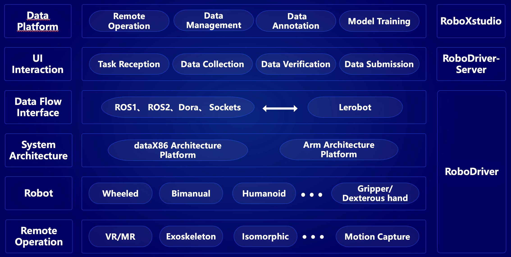
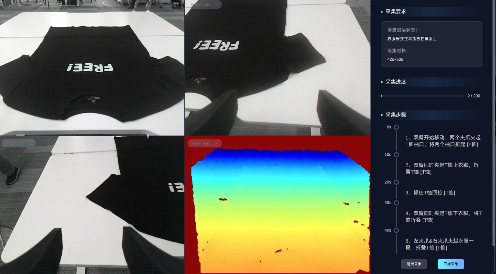
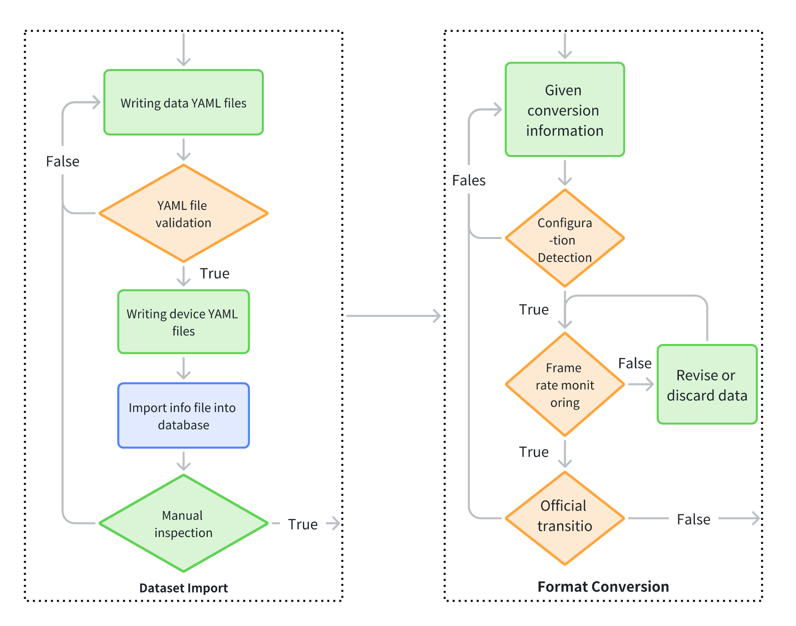
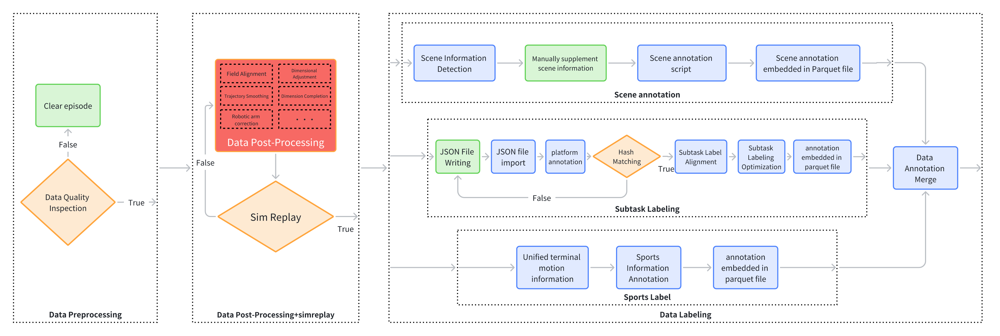
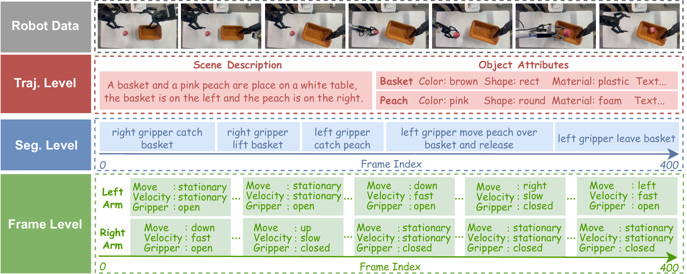

# CoRobot 1.0

[](https://github.com/FlagOpen/CoRobot/stargazers)
[](https://github.com/FlagOpen/CoRobot/issues)
[](https://github.com/FlagOpen/CoRobot/commits)
[](https://github.com/FlagOpen/CoRobot/pulls)
[](#corobot-10)

[English](README_en.md) | [中文](README.md)

CoRobot 1.0 is an open embodied-data framework for end-to-end data collection, conversion, processing, retrieval, preview, download, and training. It follows three core principles—Collaboration, Coherence, and Collective—to improve standardization and reuse efficiency for multi-robot datasets through unified data infrastructure.


## Repository Modules
| Module | Role | Highlights | Status |
| --- | --- | --- | --- |
| [`RoboCOIN`](https://github.com/FlagOpen/RoboCoin) | Data & model asset management | Multi-robot bimanual dataset: 16 robot bodies, 200k+ trajectories, 10+ scenes, 1,000+ tasks, 50+ skills, 500+ objects. | Open-sourced |
| [`RoboCOIN-DataManage`](https://github.com/FlagOpen/RoboCOIN-DataManage) | Data governance | Visual search: keyword search, visualization, helps targeted downloads. | Open-sourced |
| DataTrain | Model training | Unified training tools: quick integration/training for embodied models like OpenPI, RDT, DP. | Coming soon |
| DataCollect | Data collection | Multi-robot collection tools: supports various robot bodies and teleoperation; integrated with vendors like RMY, SLAMTEC, Galactic, Unitree, Leju, Xinhaitu, Lingyu, ZhiYuan, etc. | Coming soon |
| DataConvert | Data conversion | Conversion toolkit: bi-directional transforms among RLDS, HDF5, JSONL, and LeRobotDataset. | Coming soon |
| DataForge | Data processing | Processing toolkit: defect filtering (static frames, frame drops, dimensional mismatch, missing fields, jitter) and enrichment labels (scene, sub-task, motion description). | Coming soon |

## RoboCOIN

**RoboCOIN** is a large-scale, multi-robot, bimanual dataset for manipulation, covering 15 robot platforms, 421 tasks across 16 scenes, and 180K demonstration trajectories.

- **Resources**:
  - Homepage: https://flagopen.github.io/RoboCOIN/
  - Hugging Face: https://huggingface.co/RoboCOIN
  - ModelScope: https://modelscope.cn/organization/RoboCOIN
  - The datasets are continuously updated; licenses and versions follow each dataset page.

- **Dataset overview**:
  
  
  
  

## RoboCOIN-DataManage

RoboCOIN-DataManage is the visualization and management platform for RoboCOIN, enabling online search, preview, filtering, and download.

- **Online**: [https://flagopen.github.io/RoboCOIN-DataManage/](https://flagopen.github.io/RoboCOIN-DataManage/)

- **Key features**:
  - **Multi-dimensional filtering**: filter by scene, robot, end-effector, action, object, etc.
  - **Instant preview**: auto-playing videos and detailed info with hover overlays
  - **Intelligent search**: keyword search and Filter Finder for quick targeting
  - **Cart management**: batch select/add/remove datasets with persisted selections
  - **One-click download**: generate ModelScope/HuggingFace download commands; export Python scripts
  - **Selection import/export**: save and restore filters in JSON for team collaboration

- **UI preview**:
  
  
  
  
  
  
  
## DataTrain

## DataCollect

DataCollect is a multi-robot data collection system. This repository will be open-sourced in Dec 2025.

- **Core features**:
  - Multi-protocol streams (ROS1/ROS2, Dora, sockets)
  - Unified collection framework built on LeRobot
  - Multi-robot, multi-sensor fusion
  - Full pipeline for live capture, validation, and submission
  - Integrations with task system, annotation system, and training pipeline on the platform side

It bridges on-device capabilities with platform AI services.

- **System diagram**:



- **Data collection UI**:



## DataConvert
**DataConvert** is a dedicated toolkit for embodied data format conversion, supporting bi-directional transforms among RLDS, HDF5, LeRobotDataset, JSONL, and LeRobot formats to meet diverse training needs.
- **Dataset ingest**: author dataset `yaml` files (tasks, device models, scenes, actions, etc.), which are validated to produce `info` metadata for ingestion.
- **Format conversion**: write conversion configs, align pose files and check frame counts, then run the official conversion to produce standard LeRobot datasets (including `parquet`, `mp4`, and `meta`).
- **Tech overview**:
  

More updates coming soon.

## DataForge
**DataForge** is a toolkit for embodied data filtering and hierarchical labeling, refining raw data into high-quality **CoRobot** datasets. It handles dropped frames, freezes, artifacts, noise, grayscale frames, joint info gaps, and timestamp misalignment while adding structured labels.
- **Data pre-processing**: remove abnormal or incomplete episodes; filter static frames, frame drops, and similar issues.
- **Post-process & validation**: fix trajectory jitter, dimensional mismatch, and missing fields; verify consistency/reproducibility via Sim Replay.
- **Labeling & integration**: add RoboCOIN-specific three-level labels (scene, sub-task, motion) and embed them into `parquet` and `meta` to produce final CoRobot-format data.
- **Tech overview**: 
  
- **Hierarchical annotation**:
  

More updates coming soon.

## Community
- **Issues**: Please report bugs, feature requests, or data protocol suggestions in [GitHub Issues](https://github.com/FlagOpen/CoRobot/issues).
- **Discussions**: Coming soon for solution sharing and co-building.

## Contributor
Thanks to all contributors and multi-robot partners! Join via PRs, Issues, or community discussions:
- FlagOpen / CoRobot Team
- Community volunteers

## Citation
```bibtex
@misc{corobot2025,
  title        = {CoRobot 1.0: An Open Embodied Data Infrastructure for Multi-Robot Collaboration},
  author       = {CoRobot Team},
  year         = {2025},
  publisher    = {FlagOpen},
  howpublished = {\url{https://github.com/FlagOpen/CoRobot}}
}
```

## License
The main repo and submodules follow the licenses in their respective directories. For commercial use or large-scale deployments, please contact the maintainers; a unified open-source license will be announced in future versions.
